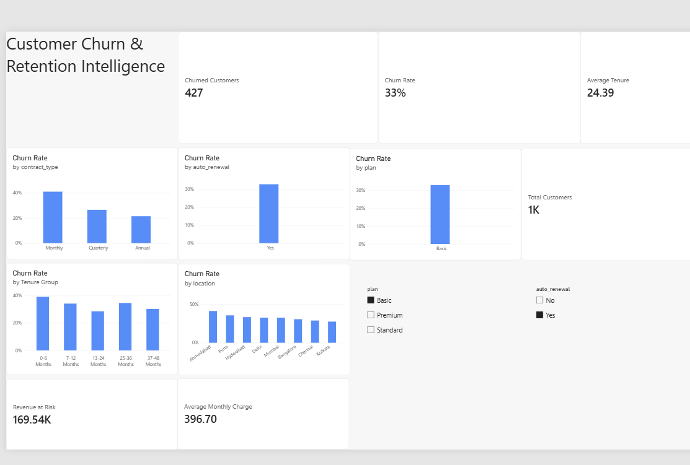
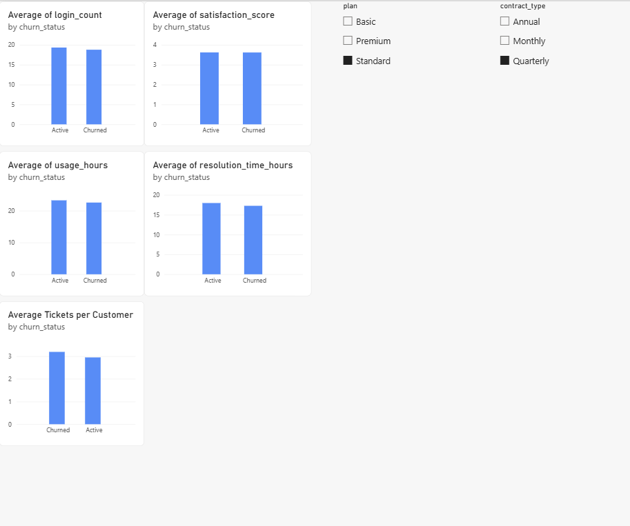
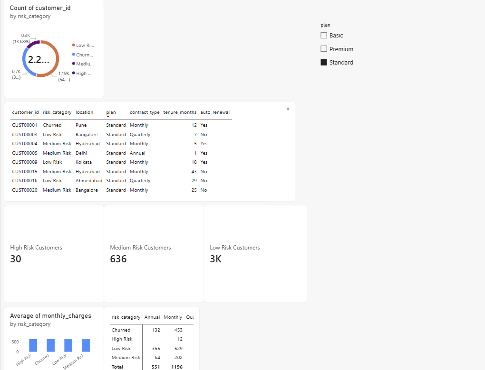
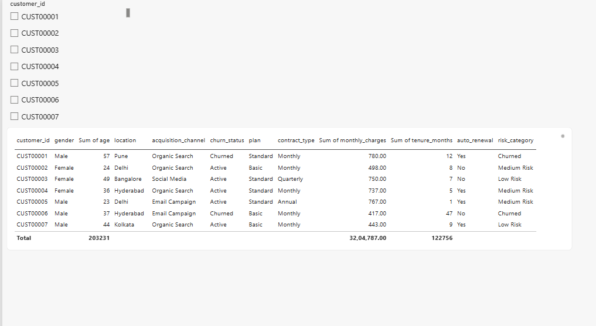

# Customer Churn & Retention Intelligence

An end-to-end analytics project designed to analyze customer churn, identify retention patterns, measure revenue exposure, and segment customers based on churn risk.

The project demonstrates a complete data analytics workflow using Python, PostgreSQL, SQL, and Power BI.

---

## Project Architecture

```text
Synthetic Dataset
       │
       ▼
     Python
Data Cleaning & EDA
       │
       ▼
   PostgreSQL
Relational Database
       │
       ▼
   SQL Analytics
Views & Risk Logic
       │
       ▼
    Power BI
Dashboard & DAX KPIs
```

## Power BI Dashboard

### Executive Overview



### Engagement & Support



### Retention & Risk



### Customer Detail


